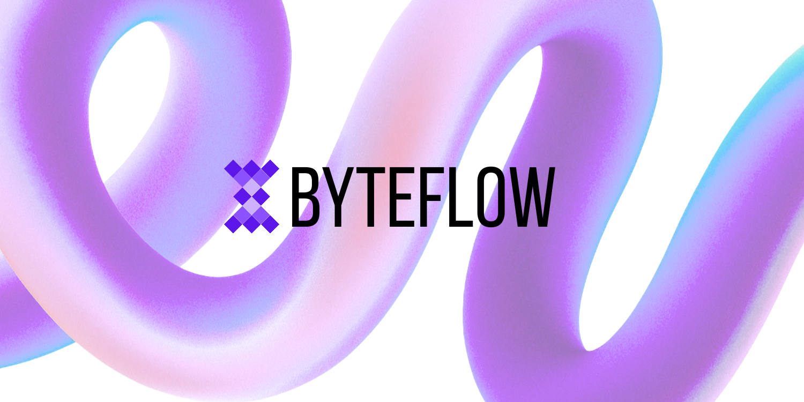
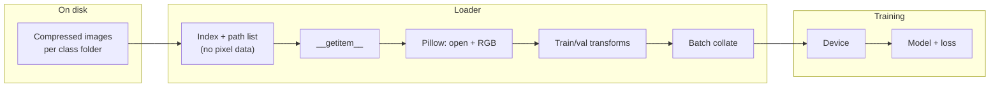
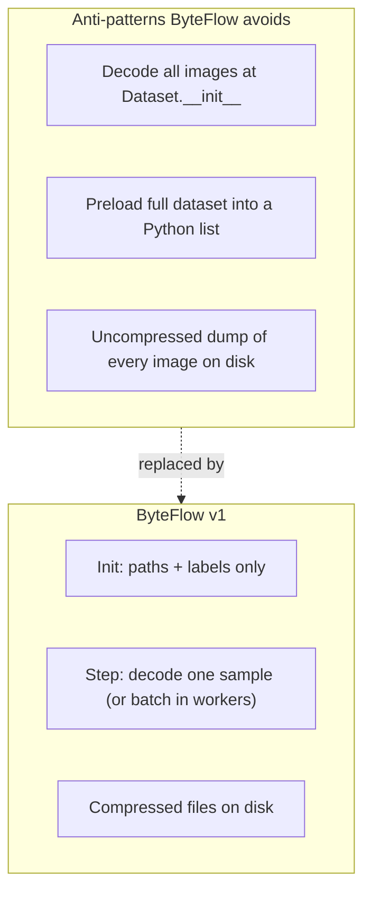
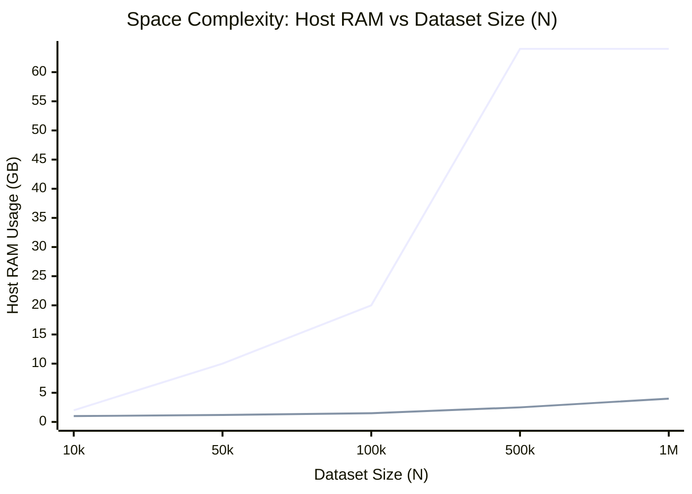
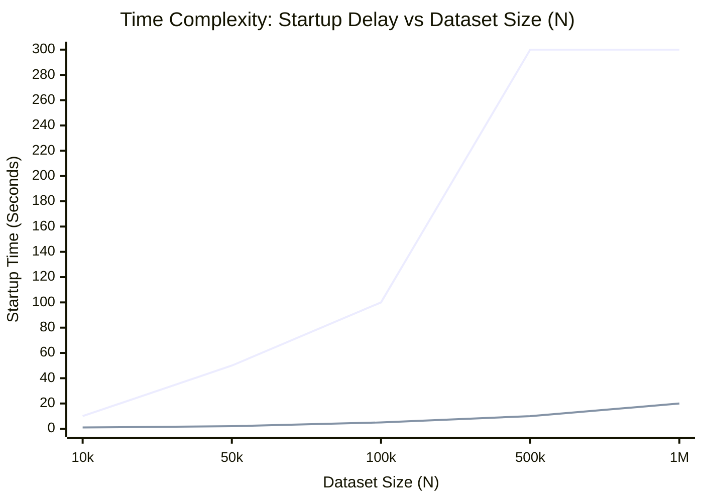
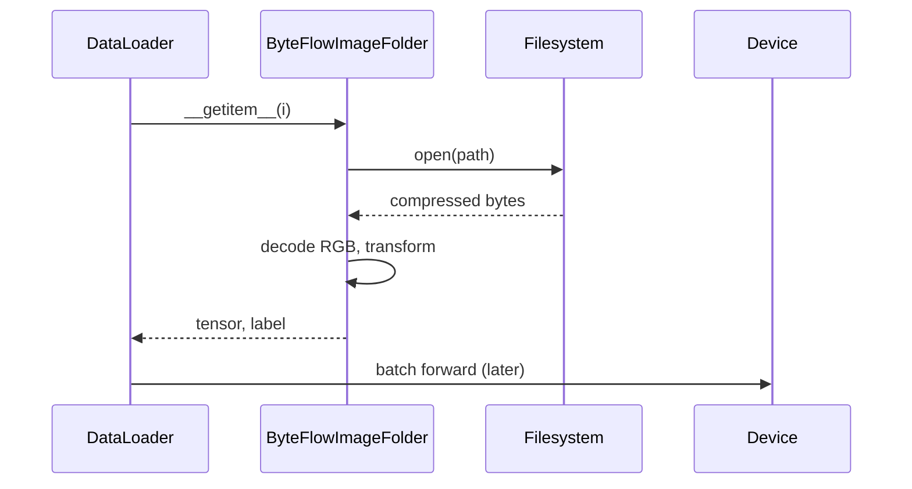

# ByteFlow v1



ByteFlow is a **focused PyTorch** image-classification trainer built around one idea: **keep images compressed on disk** and **decode a sample only when the `Dataset` is asked for it**. Nothing preloads full images at startup, decodes during the initial folder scan, or caches the whole dataset in RAM. The goal is a **small, readable, benchmarkable** baseline you can grow later.

---

## What problem does this solve?

Real datasets are often stored as **many compressed files** (JPEG, PNG, WebP). ByteFlow makes that layout **first-class**: scan class folders once, keep `(path, label)` pairs, and let `DataLoader` workers open files inside `__getitem__`. That keeps **on-disk** usage small and avoids scaling tricks that hide cost (giant extracted trees, RAM hoarding, or opaque binary formats).

---

## How data moves through ByteFlow

The pipeline is intentionally boring: **disk → decode → transform → batch → device**.



**What is _not_ stored in the dataset object:** decoded tensors, byte buffers for every file, or a materialized copy of the dataset.

---

## Memory and disk (conceptual)

Compared with “load everything first,” **host RAM** stays bounded by **model + batch + worker prefetch + framework overhead**, not by `N × image size`. Disk stays closer to **compressed file sizes** instead of an uncompressed export of every pixel.



**Important nuance:** A normal **`torchvision.datasets.ImageFolder`** setup _also_ decodes on demand in `__getitem__`. So **peak training RAM** is usually **similar** to classic file-based PyTorch loading. ByteFlow’s win is **clarity, disk footprint, and an explicit contract**—not a different GPU memory story. **VRAM** is still dominated by **architecture and batch size**.

---

## Pros and cons

### Pros

| Benefit                          | Notes                                                             |
| -------------------------------- | ----------------------------------------------------------------- |
| **Smaller disk footprint**       | JPEG/PNG/WebP beat storing raw tensors or huge BMP-style trees.   |
| **No full extraction step**      | Train from the archive-friendly files you already have.           |
| **Bounded dataset RAM**          | The `Dataset` holds paths and labels, not every decoded image.    |
| **Simple to reason about**       | Easy to log, test, and profile: “decode happens here.”            |
| **Good teaching / OSS baseline** | Few dependencies; easy to fork for v2 (shards, remote I/O, etc.). |

### Cons

| Limitation                   | Notes                                                                                       |
| ---------------------------- | ------------------------------------------------------------------------------------------- |
| **CPU + I/O cost**           | Every epoch re-reads and re-decodes files; workers must keep up with the GPU.               |
| **Many small files**         | Can be slower than **sequential** formats (tar shards, RecordIO-style blobs) on some disks. |
| **Worker tuning**            | Too few workers → GPU starvation; too many → higher **prefetch RAM**.                       |
| **Not a throughput miracle** | If “classic” already meant on-demand `ImageFolder`, **VRAM** won’t magically shrink.        |

---

## Comparisons: ByteFlow vs common setups

This is a **qualitative** comparison for choosing a direction, not a benchmark. Numbers depend on hardware, filesystem, codec, and batch size.

### Complexity Comparison Graphs





| Approach                           | Disk (typical)           | Host RAM (dataset)                          | Decode when?              | Throughput notes                                          | Complexity  |
| ---------------------------------- | ------------------------ | ------------------------------------------- | ------------------------- | --------------------------------------------------------- | ----------- |
| **ByteFlow v1** (this repo)        | Compressed files         | Paths + labels                              | `__getitem__`             | Good with enough `num_workers`; many files can stress I/O | Low         |
| **`ImageFolder` + `DataLoader`**   | Compressed files         | Paths + labels                              | `__getitem__`             | Very similar to ByteFlow in memory profile                | Low         |
| **Preload all images to RAM**      | Can avoid disk in-loop   | **Very high**                               | Once at start             | Fast iteration if it fits; breaks on large `N`            | Medium      |
| **Memory-mapped / LMDB / similar** | Often **larger** on disk | Lower than full preload; still materialized | Read slice per sample     | Can be **very** fast; build step + format lock-in         | Medium–high |
| **WebDataset / tar shards**        | Packed sequential blobs  | Paths/shard index                           | Read chunk, decode sample | Often **best** sequential throughput; more moving parts   | Medium–high |
| **Remote object store**            | Data in cloud            | Streams + buffers                           | Per read                  | Network latency dominates; not in v1                      | High        |

**Takeaway:** ByteFlow sits next to **standard folder + `ImageFolder`** on the **training RAM** axis, but emphasizes **documentation, tests, and a strict “no preload”** story. For **maximum GB/s**, teams often move toward **sharded sequential** formats later—not because folder-based loading is wrong, but because **syscall and seek patterns** change at scale.

---

## Rough lifecycle (single sample)



---

## Repository layout

```
ByteFlow/
├── logo.png
├── README.md
├── pyproject.toml
├── byteflow/
│   ├── __init__.py
│   ├── dataset.py
│   ├── engine.py
│   ├── metrics.py
│   ├── model.py
│   └── utils/
│       ├── __init__.py
│       ├── device.py
│       ├── memory.py
│       └── seed.py
├── examples/
│   ├── demo.py
│   └── sample_dataset/
└── tests/
```

---

## Install

```bash
cd ByteFlow
python -m venv .venv
source .venv/bin/activate   # Windows: .venv\Scripts\activate
pip install .
```

---

## Dataset format

Use **one subfolder per class**. Put images **directly** in that folder (v1 scans only that level, not nested class subfolders). Supported extensions: `.jpg`, `.jpeg`, `.png`, `.webp`.

```
your_dataset/
├── class_a/
│   └── ...
└── class_b/
    └── ...
```

A minimal example lives under `examples/sample_dataset/`. See `examples/sample_dataset/README.txt` for details.

---

## Demo and Usage

ByteFlow is now a Python library! You can use it in your own training scripts without being locked into a rigid config file.

See `examples/demo.py` for a fully functional training script using `argparse`. Run the demo via:

```bash
python examples/demo.py --dataset-root examples/sample_dataset --epochs 5 --lr 1e-3 --batch-size 32
```

The first run may download **torchvision ImageNet weights** for ResNet-18 (network access; on the order of tens of MB, cached under `~/.cache/torch`).

Logs include dataset path, **class → index** mapping, split sizes, batch size, workers, device, per-epoch train/val **loss and accuracy**, timing, and **CUDA memory** lines when a GPU is used.

### In your own code:

```python
import torch
import torch.nn as nn
from torch.utils.data import DataLoader
from byteflow import build_datasets, build_model, train_one_epoch, validate_one_epoch

train_ds, val_ds, class_to_idx = build_datasets(
    dataset_root="path/to/data", 
    image_size=224, 
    train_split=0.8, 
    seed=42
)
# ... build DataLoaders, model, optimizer ...
# train_m = train_one_epoch(model, train_loader, criterion, optimizer, device)
```

---

## Scope: what v1 deliberately omits

No remote storage, tar shards, WebDataset, video pipelines, distributed training, Hydra-style configs, or experiment trackers. The point is a **small, honest v1** you can extend.

---

## Tests

```bash
python -m unittest discover -s tests -v
```

---

## License

License **TBD** for now.
